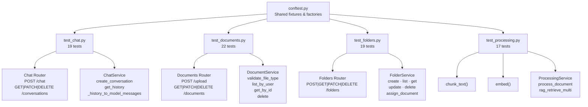
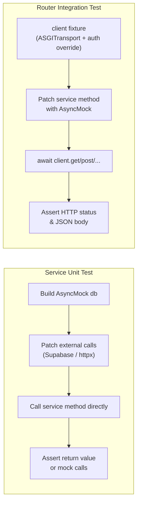

# API Test Suite

Tests for the StudyBudd FastAPI backend. All tests are pure unit/integration tests — no real database, network, or Supabase connections are made. External dependencies are replaced with `AsyncMock` / `MagicMock` / `patch`.

Run with:

```bash
just test
# or directly:
cd apps/api && uv run pytest
```

**77 tests · 0 warnings · ~0.2s**

---

## Architecture



### How each test type works



---

## conftest.py — Shared Fixtures & Factories

| Name | Type | Description |
|------|------|-------------|
| `TEST_USER_ID` | constant | `UUID("00...001")` — test user |
| `TEST_DOC_ID` | constant | `UUID("00...002")` — test document |
| `TEST_FOLDER_ID` | constant | `UUID("00...003")` — test folder |
| `mock_user` | fixture | `AuthenticatedUser` with `TEST_USER_ID` |
| `mock_db` | fixture | `AsyncMock` session; `db.add` overridden as `MagicMock` (sync in SQLAlchemy) |
| `client` | fixture | `httpx.AsyncClient` backed by the FastAPI app with auth + DB overrides injected |
| `make_mock_document(...)` | factory fn | Returns `MagicMock` satisfying `DocumentResponse.model_validate` |
| `make_mock_folder(...)` | factory fn | Returns `MagicMock` satisfying `FolderResponse.model_validate` |

---

## test_chat.py — 19 tests

### `_history_to_model_messages` (5 pure unit tests)

| Test | What it checks |
|------|---------------|
| `test_history_to_model_messages_user_row` | A `role="user"` row becomes a `ModelRequest` with a `UserPromptPart` containing the message content |
| `test_history_to_model_messages_assistant_row` | A `role="assistant"` row becomes a `ModelResponse` with a `TextPart` |
| `test_history_to_model_messages_mixed` | A 3-row mixed history preserves order and types (user → assistant → user) |
| `test_history_to_model_messages_empty` | Empty input returns `[]` |
| `test_history_to_model_messages_unknown_role_ignored` | A `role="system"` row is silently dropped |

### `ChatService` (3 async unit tests)

| Test | What it checks |
|------|---------------|
| `test_create_conversation_returns_dict` | `create_conversation()` calls Supabase insert and returns the conversation dict with an `id` |
| `test_get_history_found` | `get_history()` returns the message list when the conversation belongs to the user |
| `test_get_history_not_found_raises_404` | `get_history()` raises `HTTPException(404)` when Supabase returns no matching conversation |

### Chat Router (11 async integration tests)

| Test | Endpoint | What it checks |
|------|----------|---------------|
| `test_chat_post_new_conversation` | `POST /api/chat/` | Returns 200 with `conversation_id` when no existing conversation is provided |
| `test_chat_post_existing_conversation` | `POST /api/chat/` | Passes through an existing `conversation_id` in the request body |
| `test_list_conversations` | `GET /api/chat/conversations` | Returns 200 with a list containing the mocked conversation |
| `test_get_conversation_history_found` | `GET /api/chat/conversations/{id}` | Returns 200 with a list of messages |
| `test_get_conversation_history_not_found` | `GET /api/chat/conversations/{id}` | Returns 404 when `get_history` raises `HTTPException(404)` |
| `test_update_conversation_renames` | `PATCH /api/chat/conversations/{id}` | Returns 200 `{"status": "ok"}` when conversation is found |
| `test_update_conversation_not_found` | `PATCH /api/chat/conversations/{id}` | Returns 404 when Supabase returns empty result |
| `test_delete_conversation_success` | `DELETE /api/chat/conversations/{id}` | Returns 200 `{"status": "ok"}` when conversation is found |
| `test_delete_conversation_not_found` | `DELETE /api/chat/conversations/{id}` | Returns 404 when Supabase returns empty result |

---

## test_documents.py — 22 tests

### `DocumentService.validate_file_type` (5 pure unit tests)

| Test | What it checks |
|------|---------------|
| `test_validate_file_type_valid_pdf` | `application/pdf` → returns `"pdf"` |
| `test_validate_file_type_valid_csv` | `text/csv` → returns `"csv"` |
| `test_validate_file_type_valid_image` | `image/png` → returns `"image"` |
| `test_validate_file_type_invalid_raises_400` | `application/zip` → raises `HTTPException(400)` |
| `test_validate_file_type_no_content_type_raises_400` | `content_type=None` → raises `HTTPException(400)` |

### Documents Router (9 async integration tests)

| Test | Endpoint | What it checks |
|------|----------|---------------|
| `test_upload_pdf_returns_unsupported_processing` | `POST /api/documents/upload` | PDF upload returns `processing_status="unsupported"` (RAG not run for PDFs) |
| `test_upload_text_file_triggers_rag` | `POST /api/documents/upload` | Text file upload triggers `ProcessingService.process_document` and returns `status="ready"`, `chunks_count=3` |
| `test_upload_invalid_mime_type_returns_400` | `POST /api/documents/upload` | ZIP file returns 400 without calling the upload service |
| `test_list_documents_returns_empty` | `GET /api/documents` | Returns 200 with `total=0` and empty `documents` list |
| `test_list_documents_with_folder_filter` | `GET /api/documents?folder_id=...` | Passes `folder_id` to `list_by_user` and returns 200 with 1 document |
| `test_get_document_found_returns_200` | `GET /api/documents/{id}` | Returns 200 with correct `id` and `file_type` |
| `test_get_document_not_found_returns_404` | `GET /api/documents/{id}` | Returns 404 when service returns `None` |
| `test_assign_document_folder_success` | `PATCH /api/documents/{id}/folder` | Returns 200 with document data when doc exists |
| `test_assign_document_folder_doc_not_found` | `PATCH /api/documents/{id}/folder` | Returns 404 when document is not found |
| `test_delete_document_success` | `DELETE /api/documents/{id}` | Returns 204 when doc exists |
| `test_delete_document_not_found_returns_404` | `DELETE /api/documents/{id}` | Returns 404 when doc doesn't exist |

### `DocumentService` service layer (6 async unit tests)

| Test | What it checks |
|------|---------------|
| `test_document_service_list_by_user_no_filter` | `list_by_user()` executes a DB query and returns all user documents |
| `test_document_service_list_by_user_with_folder` | `list_by_user(folder_id=...)` passes a WHERE clause filter |
| `test_document_service_get_by_id_found` | `get_by_id()` returns the document when it exists for the user |
| `test_document_service_get_by_id_not_found` | `get_by_id()` returns `None` when no row is found |
| `test_document_service_delete_cleans_up` | `delete()` calls `delete_file` on Supabase Storage, deletes the DB record, and commits |
| `test_document_service_delete_logs_warning_on_storage_failure` | `delete()` continues and still deletes the DB record even when `delete_file` returns `False` |

---

## test_folders.py — 19 tests

### `FolderService` (9 async unit tests)

| Test | What it checks |
|------|---------------|
| `test_create_folder_strips_whitespace` | `create()` calls `Folder(name="My Folder")` (stripped) and commits |
| `test_list_by_user_returns_ordered_list` | `list_by_user()` executes a query and returns the full scalar list |
| `test_get_by_id_found` | `get_by_id()` returns the folder when a matching row exists |
| `test_get_by_id_not_found` | `get_by_id()` returns `None` when no matching row exists |
| `test_update_folder_renames_and_strips` | `update()` sets the stripped new name, commits, and refreshes the ORM object |
| `test_delete_folder_commits` | `delete()` calls `db.delete(folder)` and commits |
| `test_assign_document_to_folder` | `assign_document()` sets `document.folder_id` and commits when folder is valid |
| `test_assign_document_unfile` | `assign_document(folder_id=None)` sets `document.folder_id = None` and commits |
| `test_assign_document_wrong_folder_raises_404` | `assign_document()` raises `HTTPException(404)` when `get_by_id` returns `None` |
| `test_list_documents_in_folder` | `list_documents_in_folder()` executes a query and returns the scalar list |

### Folders Router (10 async integration tests)

| Test | Endpoint | What it checks |
|------|----------|---------------|
| `test_create_folder_endpoint` | `POST /api/folders` | Returns 201 with folder name from service |
| `test_list_folders_endpoint` | `GET /api/folders` | Returns 200 with `total=1` and 1 folder in list |
| `test_rename_folder_endpoint` | `PATCH /api/folders/{id}` | Returns 200 when folder is found |
| `test_rename_folder_not_found` | `PATCH /api/folders/{id}` | Returns 404 when `get_by_id` returns `None` |
| `test_delete_folder_endpoint` | `DELETE /api/folders/{id}` | Returns 204 on success |
| `test_delete_folder_not_found` | `DELETE /api/folders/{id}` | Returns 404 when folder not found |
| `test_list_folder_documents_endpoint` | `GET /api/folders/{id}/documents` | Returns 200 with `total=1` |
| `test_list_folder_documents_folder_not_found` | `GET /api/folders/{id}/documents` | Returns 404 when folder not found |
| `test_assign_document_to_folder_endpoint` | `PATCH /api/folders/{id}/documents/{doc_id}` | Returns 200 with document data |
| `test_assign_document_to_folder_doc_not_found` | `PATCH /api/folders/{id}/documents/{doc_id}` | Returns 404 when document not found |

---

## test_processing.py — 17 tests

### `chunk_text()` (7 pure unit tests)

| Test | What it checks |
|------|---------------|
| `test_chunk_text_empty_string` | `""` → `[]` |
| `test_chunk_text_whitespace_only` | `"  \n\t  "` → `[]` |
| `test_chunk_text_short_text_single_chunk` | Text shorter than `max_chars` → exactly one chunk with the original content |
| `test_chunk_text_exact_max_chars` | Text exactly `max_chars` long → single chunk identical to input |
| `test_chunk_text_long_text_produces_overlap` | Long text → multiple chunks, each ≤ 900 chars, with the start of chunk[1] appearing inside chunk[0] |
| `test_chunk_text_normalises_whitespace` | `"hello  \n\n  world"` → `["hello world"]` |
| `test_chunk_text_custom_params` | Custom `max_chars=20, overlap=5` → all chunks ≤ 20 chars and more than one chunk |

### `embed()` (4 async unit tests)

| Test | What it checks |
|------|---------------|
| `test_embed_no_api_key_uses_fallback` | With `together_api_key=None`, returns deterministic hash vectors of shape `(n, 768)`; calling again with the same input returns identical vectors |
| `test_embed_api_success` | With an API key, calls the Together embeddings endpoint and returns the vectors from the response |
| `test_embed_api_error_raises_502` | A 4xx response from the API raises `HTTPException(502)` |
| `test_embed_dimension_mismatch_raises_500` | API returning vectors of the wrong dimension raises `HTTPException(500)` |

### `ProcessingService.process_document()` (3 async unit tests)

| Test | What it checks |
|------|---------------|
| `test_process_document_happy_path` | Chunks text, embeds with mocked `embed()`, stores chunks in DB, returns `status="ready"` with correct `chunks_count` |
| `test_process_document_empty_text_returns_error` | Empty text produces no chunks → sets DB status `"error"`, returns `ProcessingStatusResponse(status="error", error="No text to process.")` |
| `test_process_document_embed_failure_re_raises` | When `embed()` raises `HTTPException(502)`, the DB is updated to `"error"` and the exception is re-raised |

### `ProcessingService.rag_retrieve_multi()` (4 async unit tests)

| Test | What it checks |
|------|---------------|
| `test_rag_retrieve_multi_no_ready_docs` | When no ready documents exist for the user, returns `RetrieveResult(context_text="", context_chunks=[])` |
| `test_rag_retrieve_multi_with_results` | With a ready document, embeds the question, runs similarity search, and returns chunks with correct content and `document_id` |
| `test_rag_retrieve_multi_with_folder_ids` | When `folder_ids` are provided, makes exactly 2 DB execute calls (ID resolution + similarity search) |
| `test_rag_retrieve_multi_with_document_ids` | When `document_ids` are provided directly, makes exactly 2 DB execute calls (ownership verification + similarity search) |
