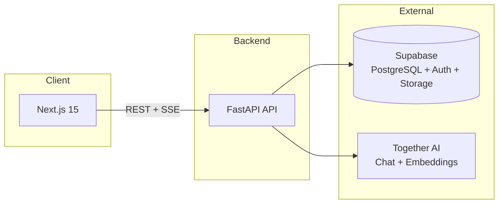
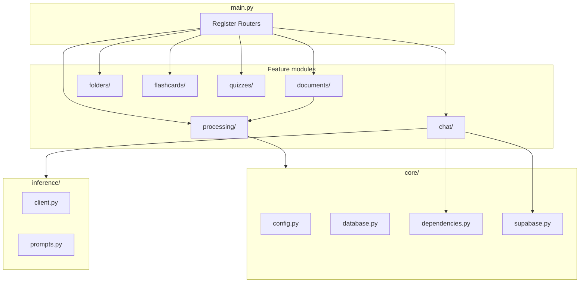
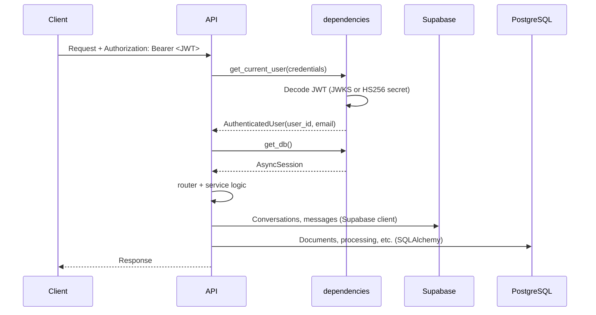
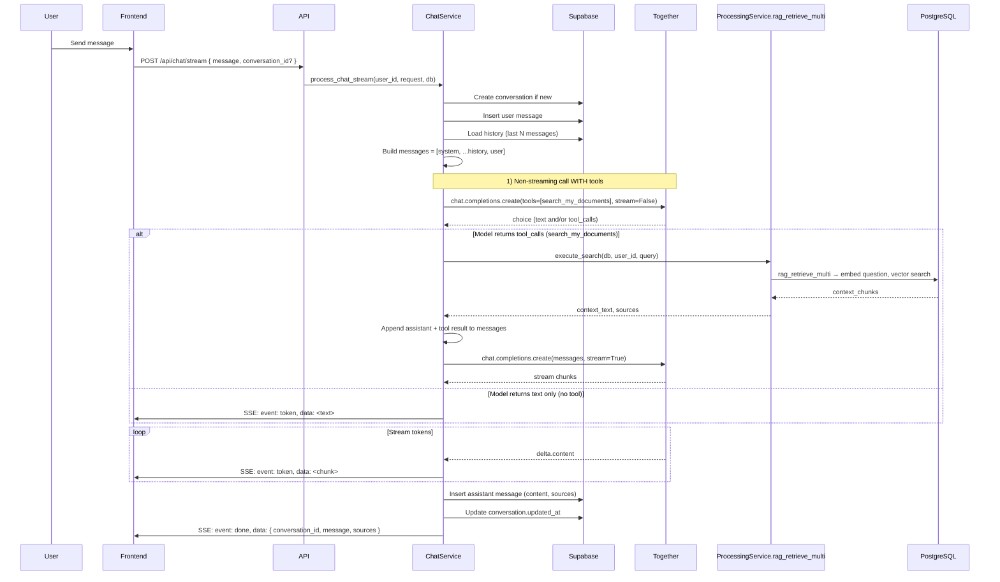
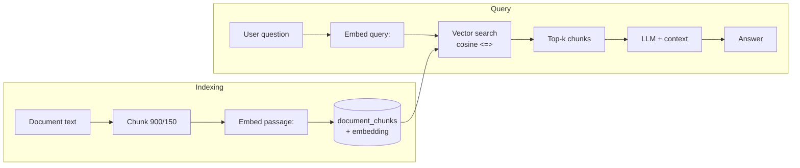
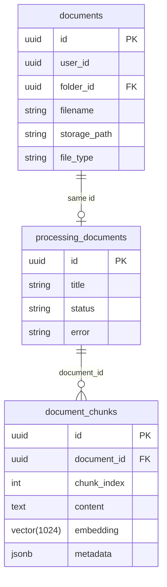
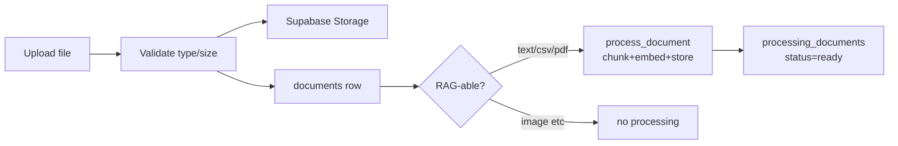

# StudyBudd API — One-Night Onboarding

**Who this is for:** Someone brand new to the codebase with a single night to get up to speed.  
**What you’ll learn:** How the API is structured, how chat works, how RAG works, and how it all fits together.

---

## Table of Contents

1. [High-Level Picture](#1-high-level-picture)
2. [API Structure](#2-api-structure)
3. [Request Flow: Auth & Database](#3-request-flow-auth--database)
4. [Chat: How It Works](#4-chat-how-it-works)
5. [RAG: How It Works](#5-rag-how-it-works)
6. [Documents & Storage](#6-documents--storage)
7. [Other Features (Folders, Flashcards, Quizzes)](#7-other-features-folders-flashcards-quizzes)
8. [Quick Reference Tables](#8-quick-reference-tables)

---

## 1. High-Level Picture

StudyBudd is a **full-stack study app**: Next.js frontend + FastAPI backend + Supabase (PostgreSQL + Auth + Storage). The backend uses **Together AI** for chat and embeddings, and **pgvector** for semantic search over your documents (RAG).

| Piece | Role |
|-------|------|
| **Frontend** | Next.js 15, talks to API with Bearer JWT. |
| **API** | FastAPI at `:8000`. Handles auth, documents, chat, RAG, flashcards, quizzes. |
| **Supabase** | PostgreSQL (tables + pgvector), Auth (JWT), Storage (file bytes). |
| **Together AI** | LLM chat (streaming) and embedding model. |

---

## 2. API Structure

The backend follows a **module-per-feature** pattern. Each feature has: **router** (HTTP) → **service** (logic) → **models** (DB) + **schemas** (Pydantic).

### Routers (prefix under `/api`)

| Prefix | Module | Purpose |
|--------|--------|---------|
| `/api/chat` | `chat/` | Conversations, messages, streaming chat (with optional RAG tool). |
| `/api/documents` | `documents/` | Upload, list, get, delete; assign to folder. |
| `/api/processing` | `processing/` | RAG: process document, status, chunks, single-doc RAG query. |
| `/api/folders` | `folders/` | CRUD folders; list docs in folder; assign doc to folder. |
| `/api/flashcards` | `flashcards/` | Generate/list/get/delete flashcard sets (RAG-powered). |
| `/api/quizzes` | `quizzes/` | Generate/list/get/delete quiz sets (RAG-powered). |

### Per-module file roles

| File | Role |
|------|------|
| `router.py` | HTTP endpoints; uses `CurrentUser`, `DbSession`; calls service. |
| `service.py` | Business logic (no HTTP). |
| `models.py` | SQLAlchemy tables (if the feature uses the app DB). |
| `schemas.py` | Pydantic request/response shapes. |

**Note:** Chat **conversations** and **messages** live in **Supabase tables** (not SQLAlchemy in this repo). Documents, processing, folders, flashcards, quizzes use **SQLAlchemy + PostgreSQL** (same Supabase DB).

---

## 3. Request Flow: Auth & Database

Every protected request: (1) **Auth** validates the JWT and gives you a user, (2) **DB** gives you an async session.

### Auth in one sentence

- **JWT** in `Authorization: Bearer <token>`.
- Validated with **Supabase**: either **JWKS** (ES256/RS256) or **HS256** with `SUPABASE_JWT_SECRET`.
- Result: `AuthenticatedUser(user_id, email)`.
- **Dev bypass:** `DEBUG=true` and `DEV_USER_ID=<uuid>` skip JWT and return that user.

### Two data paths

| Data | Where it lives | How the API touches it |
|------|----------------|------------------------|
| **Conversations & messages** | Supabase tables `conversations`, `messages` | `get_supabase_client()` → `.table("conversations")`, etc. |
| **Documents, processing, folders, flashcards, quizzes** | Same PostgreSQL DB, but via SQLAlchemy | `DbSession` (async session) → `Document`, `ProcessingDocument`, `DocumentChunk`, etc. |

---

## 4. Chat: How It Works

Chat has two modes:

1. **Non-streaming** — `POST /api/chat/` — one shot, no tool calls.
2. **Streaming** — `POST /api/chat/stream` — SSE stream; model can call **search_my_documents** (RAG) then stream the reply.

The streaming endpoint is the main one; it uses **Together AI** with a **tool** so the model can search your documents when you ask about your notes/files.

### Chat data (Supabase)

- **conversations** — `id`, `user_id`, `title`, `created_at`, `updated_at`.
- **messages** — `id`, `conversation_id`, `role` (user/assistant), `content`, `sources` (optional), `created_at`.

### Streaming chat flow (with RAG tool)

In short:

1. **First call** (non-streaming, with tools): model either returns **text** or a **tool call** `search_my_documents`.
2. If **tool call**: backend runs **RAG** (embed query → vector search across user’s docs → get context), then does a **second** call (streaming) with that context in the messages.
3. If **text only**: that text is streamed as the reply.
4. All **tokens** are sent as SSE `event: token`, then one **event: done** with final message + sources.

### Chat tool: search_my_documents

- Defined in **`chat/tools.py`** as an OpenAI-compatible function: name `search_my_documents`, single argument `query`.
- **execute_search** in the same file calls **ProcessingService.rag_retrieve_multi** (same RAG as below), then returns `(context_text, sources)`.
- The model is instructed (system prompt) to call this when the user asks about their notes/files/readings.

---

## 5. RAG: How It Works

RAG = **Retrieval-Augmented Generation**: store document chunks as **vectors**, then at query time **retrieve** the closest chunks and feed them to the LLM as context.

### Pipeline in two phases

| Phase | What happens |
|-------|----------------|
| **Indexing** | Document text → **chunk** (900 chars, 150 overlap) → **embed** (Together) → store in **document_chunks** (pgvector). |
| **Query** | User question → **embed** (same model, “query” prefix) → **cosine similarity** in pgvector → top-k chunks → LLM gets context and generates answer. |

### Tables involved (PostgreSQL)

| Table | Purpose |
|-------|--------|
| **documents** | One row per uploaded file (metadata, `user_id`, `storage_path`, `file_type`, etc.). |
| **processing_documents** | Same `id` as `documents.id`; `status` = pending \| processing \| ready \| error; `title`, `error`. |
| **document_chunks** | One row per chunk: `document_id`, `chunk_index`, `content`, **embedding** (vector 1024), `metadata` (JSONB). |

### Chunking and embedding

- **Chunking** (`processing/service.py`): `chunk_text(text, max_chars=900, overlap=150)` — sliding window, no null bytes.
- **Embedding**: Together API, model from config (e.g. `intfloat/multilingual-e5-large-instruct`). **Passages** use prefix `"passage: "`, **queries** use `"query: "`. Dimension **1024** (must match `Vector(1024)` in `document_chunks`).

### Where RAG is used

| Use case | Entry point | What runs |
|----------|-------------|-----------|
| **Chat “search my docs”** | User asks about their materials | `search_my_documents` tool → **ProcessingService.rag_retrieve_multi** (no answer generation; context is injected into chat). |
| **Single-doc “Ask”** | `POST /api/processing/rag/query` | **ProcessingService.rag_query**: embed question, vector search for that doc, then **generate_answer(question, context)** via Together. |
| **Flashcards / Quizzes** | Generate from docs | Services use the same retrieval (and possibly generation) over user docs. |

### Processing endpoints (summary)

| Endpoint | Purpose |
|----------|---------|
| `POST /api/processing/{document_id}/process` | Re-run RAG pipeline for that document (chunk + embed + store). |
| `GET /api/processing/{document_id}/status` | Get processing status and chunk count. |
| `GET /api/processing/{document_id}/chunks` | List chunks for that document. |
| `POST /api/processing/rag/query` | RAG over **one** document: question → top-k chunks → LLM answer. |

---

## 6. Documents & Storage

- **Upload:** File goes to **Supabase Storage** (bucket from config); metadata goes into **documents** (SQLAlchemy). For **text/csv/pdf**, the upload flow also runs **ProcessingService.process_document** so the file is RAG-ready.
- **List/Get/Delete:** All keyed by `user_id` (ownership). Delete also removes processing/chunks and the file from storage.
- **Folders:** Documents can have `folder_id`; folders are in **folders** table; assign via **PATCH /api/documents/{id}/folder** or folder endpoints.

---

## 7. Other Features (Folders, Flashcards, Quizzes)

- **Folders** — CRUD; list documents in a folder; assign document to folder. All scoped by `CurrentUser`.
- **Flashcards** — `POST /api/flashcards/generate` (folder/document/topic/title/num_cards); list/get/delete sets. Generation is RAG-powered (retrieve from user docs, then LLM).
- **Quizzes** — Same idea: `POST /api/quizzes/generate` (folder/document/topic/num_questions); list/get/delete sets.

Same pattern: **router** → **service** → **models/schemas**; auth via `CurrentUser`, data via `DbSession`.

---

## 8. Quick Reference Tables

### Main entry points (code)

| What | Where |
|------|--------|
| App and routers | `apps/api/app/main.py` |
| Auth | `app/core/dependencies.py` — `get_current_user`, `CurrentUser` |
| DB session | `app/core/database.py` + `get_db` in dependencies → `DbSession` |
| Chat streaming + tool | `app/chat/service.py` — `process_chat_stream`; tools in `app/chat/tools.py` |
| RAG retrieval (multi-doc) | `app/processing/service.py` — `ProcessingService.rag_retrieve_multi` |
| RAG single-doc query | `app/processing/service.py` — `ProcessingService.rag_query`, `generate_answer` |
| Chunking + embedding | `app/processing/service.py` — `chunk_text`, `embed` |
| Document upload | `app/documents/service.py` — `DocumentService.upload`; router triggers processing |
| Supabase (storage + chat tables) | `app/core/supabase.py` |

### Environment (important vars)

| Variable | Purpose |
|----------|---------|
| `DATABASE_URL` | PostgreSQL (async: `postgresql+asyncpg://...`). |
| `SUPABASE_URL`, `SUPABASE_SERVICE_KEY` | Supabase client (storage, auth tables). |
| `SUPABASE_JWT_SECRET` | HS256 JWT validation (optional if using JWKS). |
| `TOGETHER_API_KEY` | Chat + embeddings. |
| `TOGETHER_MODEL`, `TOGETHER_EMBED_MODEL` | Model names. |
| `DEBUG`, `DEV_USER_ID` | Dev auth bypass. |

### Ports and commands

| Service | Port | Run (from repo) |
|---------|------|------------------|
| API | 8000 | `just api` or `cd apps/api && uv run uvicorn app.main:app --reload` |
| Web | 3000 | `just web` |
| DB | 6543 (pooler) / 5432 (direct) | Supabase |

---

You now have a single-doc map of **how the API is structured**, **how chat and RAG work**, and **where to look** for auth, documents, and storage. For deeper dives, see `docs/backend/processing/rag-flow.md`, `docs/backend/chat/chat-streaming.md`, and `docs/backend/documents/document-upload.md`.
