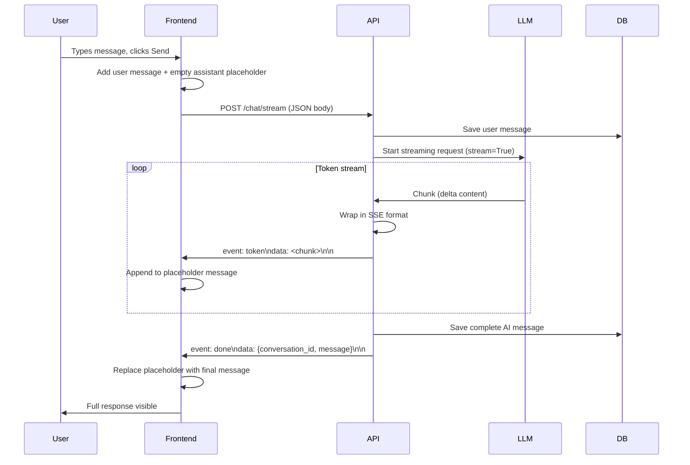
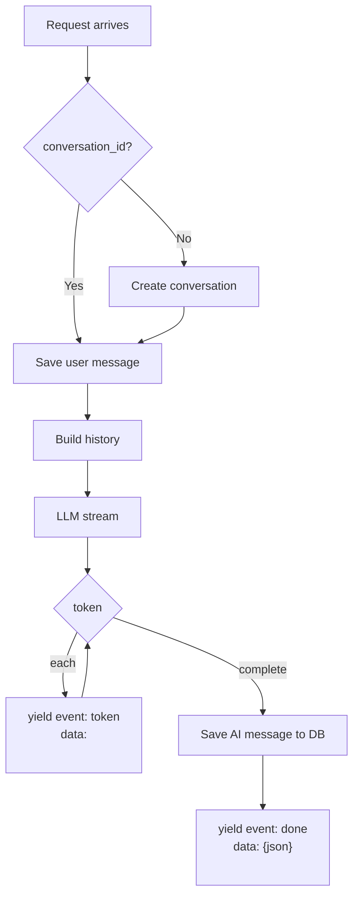
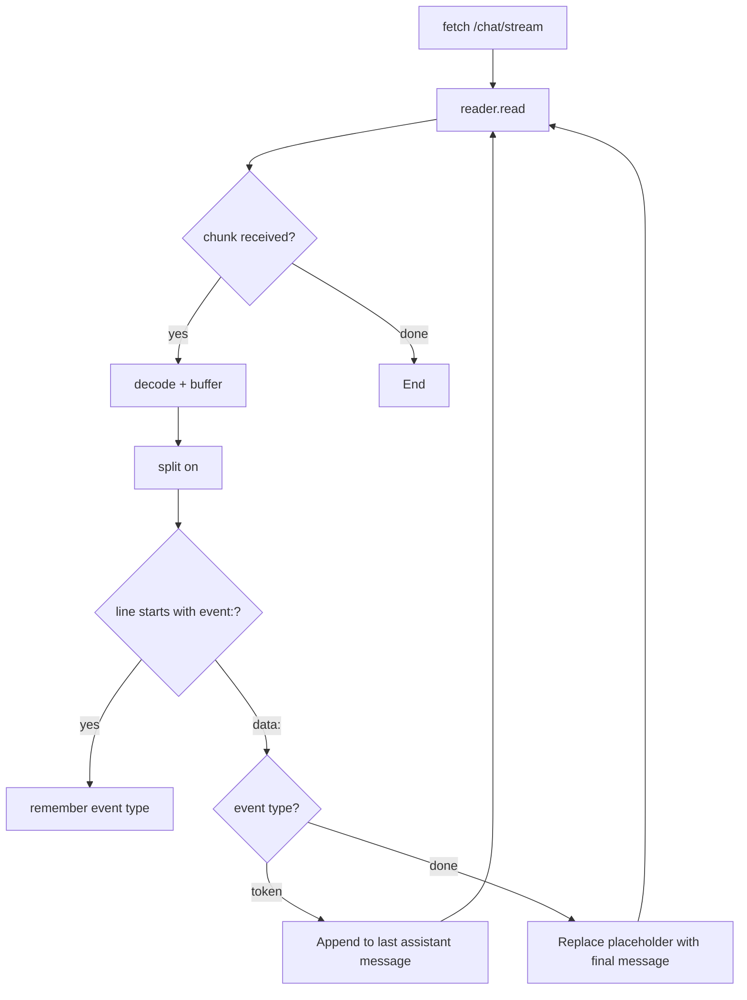

# Chat Streaming Architecture

This document explains how the chat streaming feature works end-to-end, from the browser to the Together AI API and back.

## Overview

When you send a message in the chat, the response is **streamed** token-by-token instead of waiting for the full reply. This uses **Server-Sent Events (SSE)** over HTTP.

```mermaid
flowchart LR
    subgraph Browser
        UI[Chat UI]
        RS[ReadableStream]
        Parser[SSE Parser]
        UI --> RS
        RS --> Parser
        Parser --> UI
    end

    subgraph API
        Router[/chat/stream]
        Service[ChatService]
        LLM[LLMClient]
        Router --> Service
        Service --> LLM
    end

    subgraph External
        Together[Together AI API]
    end

    Browser -->|POST + Bearer token| Router
    Router -->|SSE stream| Browser
    LLM -->|stream=True| Together
    Together -->|chunks| LLM
```

---

## Data Flow (High Level)



---

## Component Breakdown

### 1. Together AI (LLM Provider)

The inference client calls Together AI's chat completions API with `stream=True`:

```python
stream = await self.client.chat.completions.create(
    model="Qwen/Qwen3-235B-A22B-Instruct-2507-tput",
    messages=messages,
    stream=True,
)

async for chunk in stream:
    delta = chunk.choices[0].delta
    if delta.content:
        yield delta.content
```

Each chunk contains a small piece of text (often a token or subword). The client yields these as they arrive.

**Location:** `apps/api/app/inference/client.py`

---

### 2. Chat Service (Orchestration)

`process_chat_stream` coordinates the full flow:

1. **Create conversation** if needed (new chat)
2. **Save user message** to the database
3. **Build history** from recent messages for context
4. **Stream tokens** from the LLM, wrapping each in SSE format
5. **Accumulate** the full response as it streams
6. **Save AI message** to the database when done
7. **Emit `done` event** with final metadata (conversation_id, message id, etc.)



**Location:** `apps/api/app/chat/service.py` → `process_chat_stream`

---

### 3. Server-Sent Events (SSE) Format

SSE is a simple text protocol. Each event has:

- `event: <name>` – event type
- `data: <payload>` – event data (one line)
- A blank line to end the event

Example stream:

```
event: token
data: Hello

event: token
data: , 

event: token
data: how

event: token
data:  can

event: token
data:  I help

event: token
data: ?

event: done
data: {"conversation_id":"uuid","message":{"id":"msg-uuid","role":"assistant","content":"Hello, how can I help?","created_at":"..."}}

```

**Token events** – streamed many times as the LLM generates text  
**Done event** – sent once at the end with the full message and DB ids

---

### 4. FastAPI StreamingResponse

The router exposes the generator as an HTTP stream:

```python
return StreamingResponse(
    chat_service.process_chat_stream(user_id, request),
    media_type="text/event-stream",
    headers={
        "Cache-Control": "no-cache",
        "X-Accel-Buffering": "no",  # Disable nginx buffering
    },
)
```

**Location:** `apps/api/app/chat/router.py` → `POST /stream`

---

### 5. Frontend (React)

1. **Optimistic UI** – The user message appears immediately; an empty assistant message is added as a placeholder.
2. **Fetch** – `fetch()` opens a long-lived connection to `/chat/stream`.
3. **ReadableStream** – `res.body.getReader()` reads the response body incrementally.
4. **Buffer parsing** – Incoming bytes are decoded and split on newlines. Incomplete lines stay in the buffer.
5. **SSE parsing** – For each `event: token` + `data: <chunk>`, append the chunk to the placeholder message.
6. **Done event** – Replace the placeholder with the final message object (including `id`, `created_at` from the DB).
7. **Sidebar refresh** – If it was a new conversation, update `activeId` and reload the thread list.



**Location:** `apps/web/src/app/dashboard/chat/page.js` → `sendMessage`

---

## Key Design Decisions

| Decision | Reason |
|----------|--------|
| **SSE over WebSockets** | Simpler: one-way server→client, works over HTTP, no handshake. |
| **Accumulate then save** | Full message is persisted only after the stream completes, so we have a single DB row. |
| **Placeholder + replace** | UI shows tokens as they arrive; `done` swaps in the canonical message with DB ids. |
| **Buffer for incomplete lines** | SSE events can span chunks; we keep partial lines until we see `\n`. |

---

## File Reference

| Layer | File | Key function / component |
|-------|------|---------------------------|
| LLM | `apps/api/app/inference/client.py` | `LLMClient.chat()` – async generator yielding tokens |
| Service | `apps/api/app/chat/service.py` | `process_chat_stream()` – orchestrates DB + stream |
| Router | `apps/api/app/chat/router.py` | `POST /stream` – `StreamingResponse` |
| Frontend | `apps/web/src/app/dashboard/chat/page.js` | `sendMessage()` – fetch, ReadableStream, SSE parsing |
