# RAG Setup (StudyBudd)

This doc describes how the RAG (Retrieval-Augmented Generation) system works and how to set up the database. For a quick map of the API and where RAG fits, see [api-onboarding.md](../api-onboarding.md).

---

## How RAG Works in StudyBudd

RAG gives the app **semantic search over your documents** so the chat, “Ask document,” flashcards, and quizzes can use your uploaded content as context. There are two main flows: **ingestion** (turning documents into searchable chunks) and **retrieval** (finding relevant chunks and optionally generating an answer).

### Ingestion: From Document to Searchable Chunks

When you upload a **text, CSV, or PDF** file:

1. The file is stored in **Supabase Storage** and metadata is saved in the **documents** table (owned by the user).
2. Text is **extracted** from the file (raw text for .txt/.csv; PDFs use extraction that yields text).
3. The text is **chunked** into overlapping segments (900 characters, 150-character overlap) so that related sentences stay together and context crosses chunk boundaries.
4. Each chunk is **embedded** via the **Together AI** embeddings API using the E5-instruct model (`intfloat/multilingual-e5-large-instruct`). Chunks use the `"passage: "` prefix; the API returns 1024-dimensional vectors.
5. Chunks and their vectors are stored in **PostgreSQL** in the **processing_documents** and **document_chunks** tables. The **pgvector** extension is used so that similarity search (cosine distance) can run in the database.

If extraction fails or the file type is not supported for RAG, the document still exists in Storage and in the documents table; only the processing status is set to `error` or `unsupported`. You can re-run processing for a document via `POST /processing/{document_id}/process` (e.g. after fixing extraction or re-uploading).

### Retrieval: Two Ways RAG Is Used

- **Single-document Q&A**  
  The user asks a question about **one** document (e.g. from the Files UI “Ask” flow). The API embeds the question with the `"query: "` prefix, runs **cosine similarity** over that document’s chunks in **document_chunks**, takes the **top-k** chunks (default 5), and sends them plus the question to the **Together chat model** with a system prompt that says “answer only from this context.” The response is the generated answer plus the chunks used.

- **Multi-document retrieval (no answer)**  
  Chat, flashcards, and quizzes need context from **many** documents (e.g. all of the user’s docs, or a folder). The service method **`rag_retrieve_multi`** does: resolve which documents to search (by folder, by document IDs, or all RAG-ready docs for the user), embed the question once, run similarity search **across** those documents’ chunks, and return the **context text** and the list of matched chunks. The **caller** (chat tool, flashcard generator, quiz generator) then uses that context to generate the reply or the cards/questions. No second “answer” step is done inside processing.

```mermaid
flowchart TB
    subgraph Single doc["Single-document Q&A (e.g. Ask document)"]
        Q1[Question] --> E1[Embed question]
        E1 --> S1[Cosine search in doc chunks]
        S1 --> T1[Top-k chunks]
        T1 --> L1[LLM with context]
        L1 --> A1[Answer + chunks]
    end

    subgraph Multi["Multi-document retrieval (chat, flashcards, quizzes)"]
        Q2[Question] --> R[Resolve doc set]
        R --> E2[Embed question]
        E2 --> S2[Cosine search across docs]
        S2 --> T2[Top-k chunks]
        T2 --> C[Context text + chunks]
        C --> U[Caller uses context]
    end
```

### Key Parameters

| What | Value | Where |
|------|--------|--------|
| Chunk size | 900 characters | `processing.service` |
| Overlap | 150 characters | `processing.service` |
| Embedding dimension | 1024 | Matches E5-instruct; `Vector(1024)` in models and service |
| Embed model | `intfloat/multilingual-e5-large-instruct` | `TOGETHER_EMBED_MODEL` |
| Passage/query prefix | `"passage: "` / `"query: "` | E5-instruct convention in `embed()` |
| Default top-k | 5 | `rag_query` and `rag_retrieve_multi` |

The chat/LLM model is configured separately (`TOGETHER_MODEL`); RAG only uses it for the single-document answer generation step.

---

## Database Setup

RAG uses two tables and the **pgvector** extension.

### Tables

- **processing_documents** – One row per document that has been (or is being) processed. Stores `id` (same UUID as the user’s document), `title`, `status` (`pending` / `processing` / `ready` / `error`), and optional `error` message.
- **document_chunks** – One row per chunk: `document_id`, `chunk_index`, `content`, `metadata` (JSONB), and **embedding** (pgvector `vector(1024)`). Indexed for fast similarity search with HNSW and cosine distance (`<=>`).

The app resolves at runtime which schema the `vector` type lives in (`public`, `extensions`, or `vector_db`) so it works with Supabase’s default or dashboard-enabled pgvector.

### Enable pgvector and create tables

1. In the **Supabase Dashboard**: **Database** → **Extensions** → enable **pgvector**.
2. Create the RAG tables and index in the **SQL Editor** (or use the direct connection if you run DDL from your machine). The app expects **processing_documents** and **document_chunks** with an `embedding` column of type `vector(1024)` and an HNSW index for cosine distance. Schema is not managed by migration scripts in this repo.
3. Confirm in the dashboard that **processing_documents** and **document_chunks** exist.

### If “vector does not exist” or 503 “Vector type not found”

- Ensure pgvector is enabled (Database → Extensions).
- Run migrations against the **direct** connection (port 5432). If the app still fails with vector-related errors, point **DATABASE_URL** at the direct connection (port 5432) so the app sees the same vector type as migrations.

---

## Summary

- **Ingestion**: Upload → extract text → chunk (900/150) → embed with E5-instruct (`passage: `) → store in **processing_documents** + **document_chunks** (pgvector).
- **Single-doc Q&A**: Embed question (`query: `) → cosine search in that doc’s chunks → top-k → LLM → answer.
- **Multi-doc**: `rag_retrieve_multi` resolves doc set → embed question → cosine search across those chunks → return context + chunks for chat/flashcards/quizzes to use.
- **Setup**: Enable pgvector in Supabase, create the RAG tables (e.g. via SQL Editor). Fix “vector does not exist” by using the direct connection (port 5432) for the app if the pooler doesn’t expose the type.
