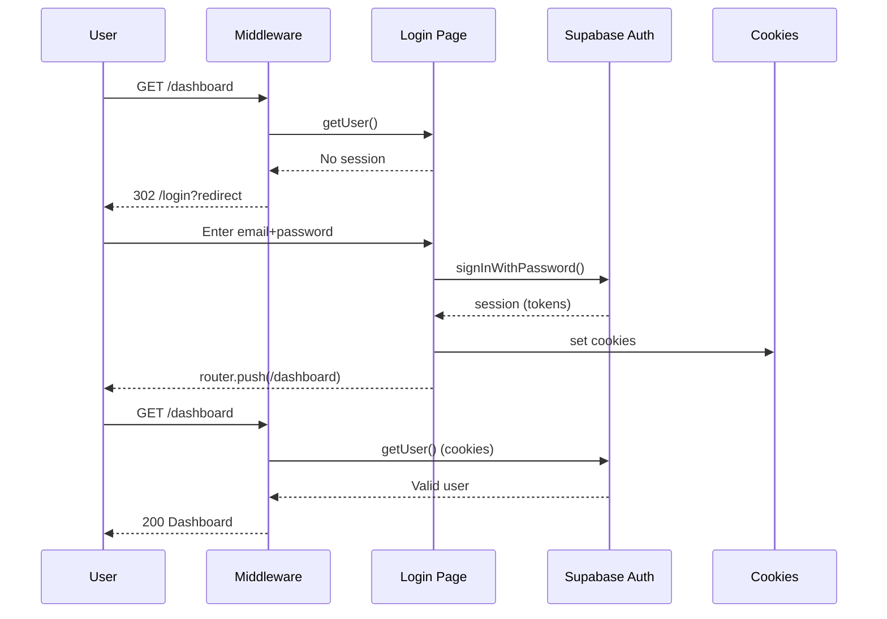
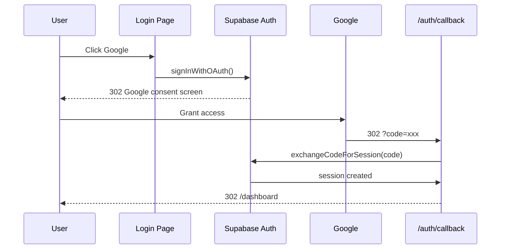
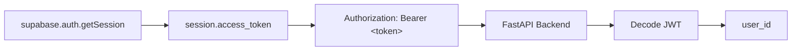
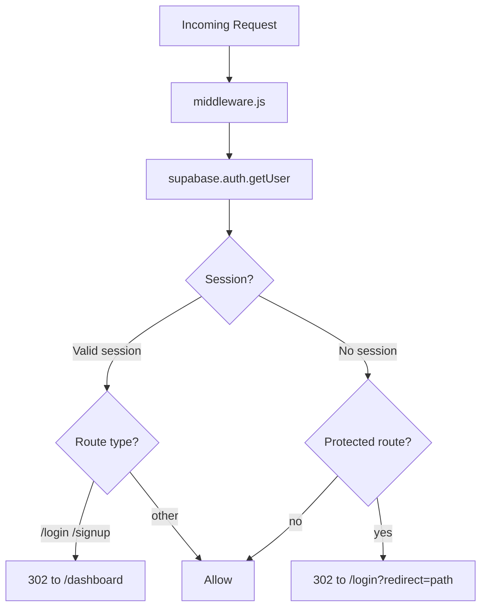
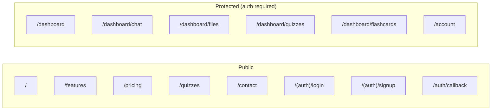
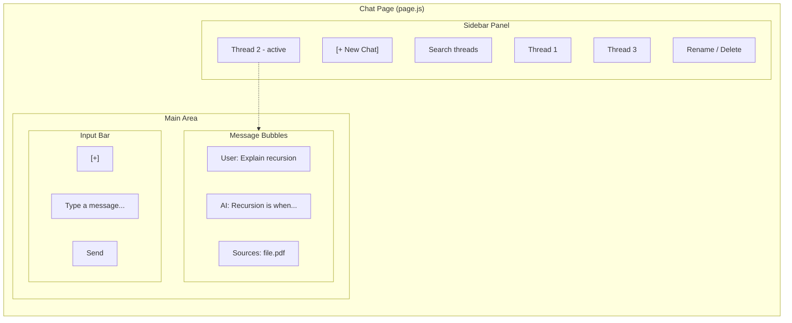
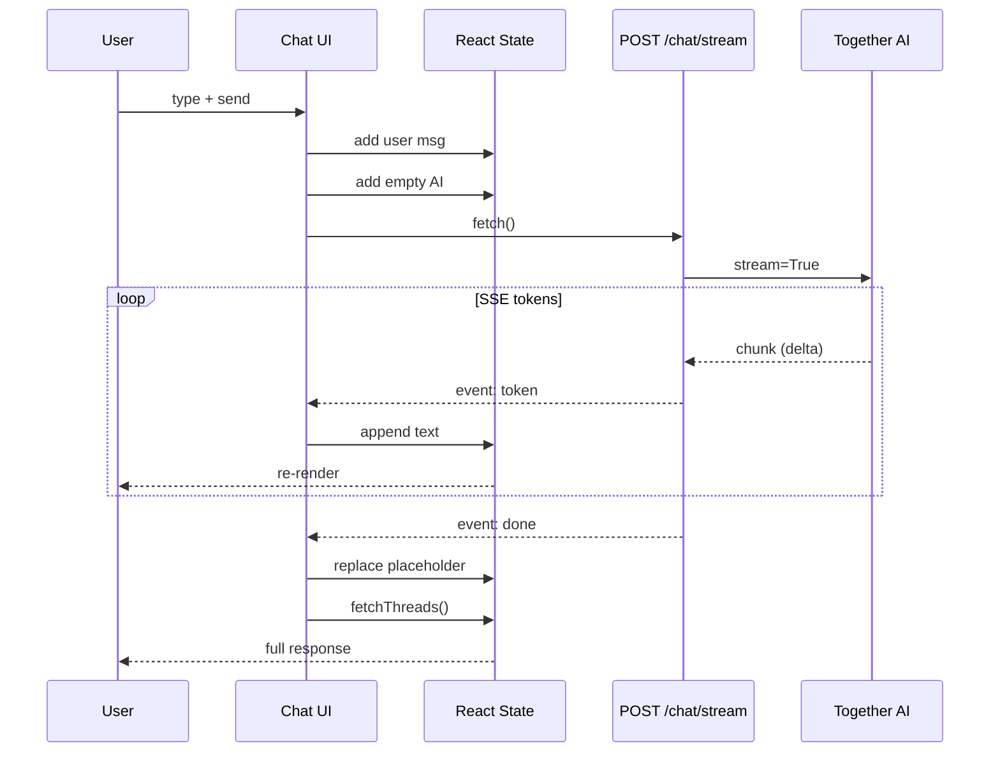
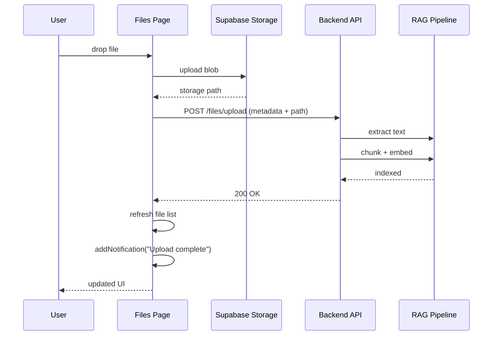

# Frontend Architecture

This document maps the full frontend system — how the Next.js app is structured, where data flows, and how it splits between direct Supabase access and backend API calls.

---

## High-Level Architecture

```mermaid
flowchart TB
  subgraph browser["BROWSER (Next.js App)"]
    subgraph pages["Pages (App Router)"]
      p1[Landing]
      p2[Login/Signup]
      p3[Dashboard]
      p4[Chat]
      p5[Files]
      p6[Features]
      p7[OAuth Callback]
      p8[Account]
      p9[Quizzes]
      p10[Flashcards]
    end
    subgraph providers["Global Providers (Root Layout)"]
      np[NotificationsContext]
      pp[PomodoroProvider]
    end
    subgraph client["Client Layer"]
      sup[Supabase Browser Client]
      axios[Axios HTTP Client]
      sse[Fetch + SSE]
    end
    pages --> providers --> client
  end

  sup --> supabase
  axios --> backend
  sse --> backend

  subgraph supabase["SUPABASE (Direct)"]
    auth[Auth service]
    profiles[profiles table]
    pomodoro[pomodoro_sessions]
    prod[productivity_days]
    storage[Storage bucket]
  end

  subgraph backend["FASTAPI BACKEND (:8000)"]
    stream["/chat/stream (SSE streaming)"]
    conv["/conversations (CRUD)"]
    upload["/files/upload (RAG indexing)"]
    together[Together AI (LLM Provider)]
    stream --> together
  end
```

---

## The Two Data Paths

The frontend talks to two backends depending on the operation. This is the core architectural split.

```mermaid
flowchart LR
  rc[React Component]

  subgraph path1["PATH 1: Direct Supabase"]
    sc[Supabase Client\n(anon key + RLS)]
    pg[(Supabase Postgres\nRLS rules)]
    st[(Supabase Storage)]
    sc --> pg
    sc --> st
  end

  subgraph path2["PATH 2: Backend API"]
    ax[Axios / Fetch\nBearer token in header]
    fa[FastAPI :8000]
    sp[(Supabase Postgres\nservice key)]
    ai[Together AI LLM]
    ax --> fa
    fa --> sp
    fa --> ai
  end

  rc --> path1
  rc --> path2
```

| What | Path | Why |
|------|------|-----|
| Auth (login, signup, OAuth) | Direct Supabase | Supabase handles sessions, cookies, token refresh natively |
| Profile read/update | Direct Supabase | Simple CRUD on `profiles` table, RLS protects per-user rows |
| Pomodoro session logging | Direct Supabase | Insert-only writes to `pomodoro_sessions` + upsert `productivity_days` |
| File upload/list/delete | Both | Upload goes to Supabase Storage; metadata + RAG indexing go through API |
| Chat streaming | Backend API | Requires LLM orchestration, history building, SSE streaming |
| Conversation CRUD | Backend API | Backend owns conversation/message schema and RAG context |

---

## Authentication Flow

### Email/Password Login



### Google OAuth



### How the Token Reaches the API



Every API call extracts the access token from the Supabase session and sends it as a Bearer header. The backend decodes the JWT to identify the user — no separate login needed.

---

## Routing and Middleware



### Route Map



---

## State Management

```mermaid
flowchart TB
  subgraph root["Root Layout (layout.js)"]
    subgraph providers["Providers"]
      np["NotificationsProvider<br/>notifications[] unreadCount<br/>addNotification() markAllRead() clearAll()"]
      pp["PomodoroProvider"]
      ls[(localStorage<br/>persist timer state)]
      pp --> ls
    end
  end

  subgraph consumers["Consuming Components"]
    nav[Navbar: auth state (onAuthStateChange)<br/>+ notifications context]
    side[Sidebar: pomodoro card context]
    chat[Chat Page: local useState messages]
    account[Account Page: local useState profile]
    login[Login Page: URL query params ?redirect=]
  end

  root --> consumers
```

No global store (Redux, Zustand). State is managed via:

1. **React Context** — notifications and pomodoro timer (app-wide)
2. **Supabase auth listener** — `onAuthStateChange` keeps auth state in sync
3. **Component-local `useState`** — each page manages its own data
4. **localStorage** — pomodoro timer persists across page navigations

---

## Chat Page Architecture (Deep Dive)

The chat page is the most complex frontend component. It combines REST API calls, SSE streaming, and local state management.



### Data Flow

```mermaid
flowchart LR
  subgraph state["Local State"]
    threads[threads[]]
    messages[messages[]]
    activeId[activeId]
    streaming[streaming]
    token[accessToken]
  end

  subgraph api["Backend API"]
    list[GET /conversations]
    get[GET /conversations/:id]
    stream[POST /chat/stream SSE]
    patch[PATCH /conversations/:id]
    del[DELETE /conversations/:id]
  end

  state -->|on mount| list
  state -->|click thread| get
  state -->|send message| stream
  state -->|rename| patch
  state -->|delete| del

  list --> threads
  get --> messages
```

### Message Streaming Sequence



---

## File Upload Flow



---

## Component Hierarchy

```mermaid
flowchart TD
  root["layout.js (Root)"]
  root --> NotificationsProvider
  NotificationsProvider --> PomodoroProvider
  PomodoroProvider --> Navbar
  PomodoroProvider --> children["{children} - page content"]
  PomodoroProvider --> Footer

  Navbar --> nav1[Logo + nav links]
  Navbar --> NotificationBell[NotificationBell - NotificationsContext]
  Navbar --> Avatar[User avatar dropdown]
  Avatar --> DashboardLink[Dashboard link]
  Avatar --> AccountLink[Account link]
  Avatar --> SignOut[Sign out]

  children --> Landing[Landing page /]
  children --> Login[Login page]
  children --> Signup[Signup page]
  children --> Account[Account page]
  children --> DashboardLayout[Dashboard layout /dashboard/*]

  Account --> AvatarUploader
  Account --> ProfileForm[Profile form]
  Account --> ProductivityHeatmap

  DashboardLayout --> Sidebar[Sidebar sticky]
  DashboardLayout --> dashChildren["{children} - dashboard page"]

  Sidebar --> NavLinks[Nav links: Files, Chat, Quizzes, Flashcards]
  Sidebar --> PomodoroSidebarCard[PomodoroSidebarCard]
  PomodoroSidebarCard --> SVG[SVG progress ring + controls]

  dashChildren --> DashboardHome[Dashboard home]
  dashChildren --> ChatPage[Chat]
  dashChildren --> FilesPage[Files]
  dashChildren --> QuizzesPage[Quizzes]
  dashChildren --> FlashcardsPage[Flashcards]

  DashboardHome --> Greeting[Greeting header]
  DashboardHome --> ContinueCards[Continue Where You Left Off cards]
  DashboardHome --> ToolsGrid[Your Tools grid]
  DashboardHome --> UpgradeCTA[Upgrade CTA banner]

  ChatPage --> ThreadSidebar[Thread sidebar + search]
  ChatPage --> MessageArea[Message area + markdown renderer]
  ChatPage --> InputBar[Input bar + file attach]

  FilesPage --> DocumentUpload[DocumentUpload drag-and-drop]
  FilesPage --> FileList[File list table]

  QuizzesPage --> QuestionCards[Question + answer cards]
  QuizzesPage --> ProgressRing[Progress ring]
  QuizzesPage --> ResultsSummary[Results summary]

  FlashcardsPage --> DeckSwitcher[Deck switcher]
  FlashcardsPage --> FlipCard[3D flip card]
  FlashcardsPage --> StudyTabs[Study mode tabs]
```



---

## File Reference

| Layer | File | Purpose |
|-------|------|---------|
| Supabase client (browser) | `src/lib/supabase/client.js` | Creates browser-safe Supabase instance |
| Supabase client (server) | `src/lib/supabase/server.js` | Creates server client with cookie handling |
| Middleware | `src/middleware.js` | Route protection + session refresh |
| Root layout | `src/app/layout.js` | Wraps providers (notifications, pomodoro) |
| Dashboard layout | `src/app/dashboard/layout.jsx` | Sidebar + content grid |
| Chat page | `src/app/dashboard/chat/page.js` | SSE streaming, conversation management |
| Files page | `src/app/dashboard/files/page.js` | Upload, list, delete documents |
| Quizzes page | `src/app/dashboard/quizzes/page.js` | Interactive quiz flow |
| Flashcards page | `src/app/dashboard/flashcards/page.js` | 3D flip cards, deck management |
| Account page | `src/app/account/page.js` | Profile editing, avatar, heatmap |
| Login | `src/app/(auth)/login/page.js` | Email/password + Google OAuth |
| Signup | `src/app/(auth)/signup/page.js` | Registration form |
| OAuth callback | `src/app/auth/callback/route.js` | Exchange OAuth code for session |
| Profile helpers | `src/lib/profile.js` | Read/update `profiles` table |
| Pomodoro logging | `src/lib/pomodoro/logFocusCompletion.js` | Log sessions to Supabase |
| Pomodoro store | `src/app/components/pomodoroStore.js` | Timer state + localStorage persistence |
| Notifications | `src/app/components/NotificationsContext.jsx` | App-wide notification context |
| Navbar | `src/app/components/Navbar.jsx` | Top nav, auth state, user menu |
| Heatmap | `src/app/components/ProductivityHeatmap.jsx` | GitHub-style focus time grid |
