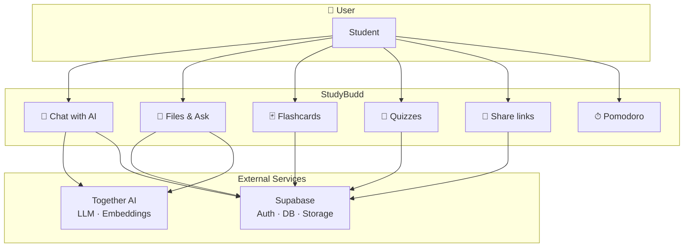
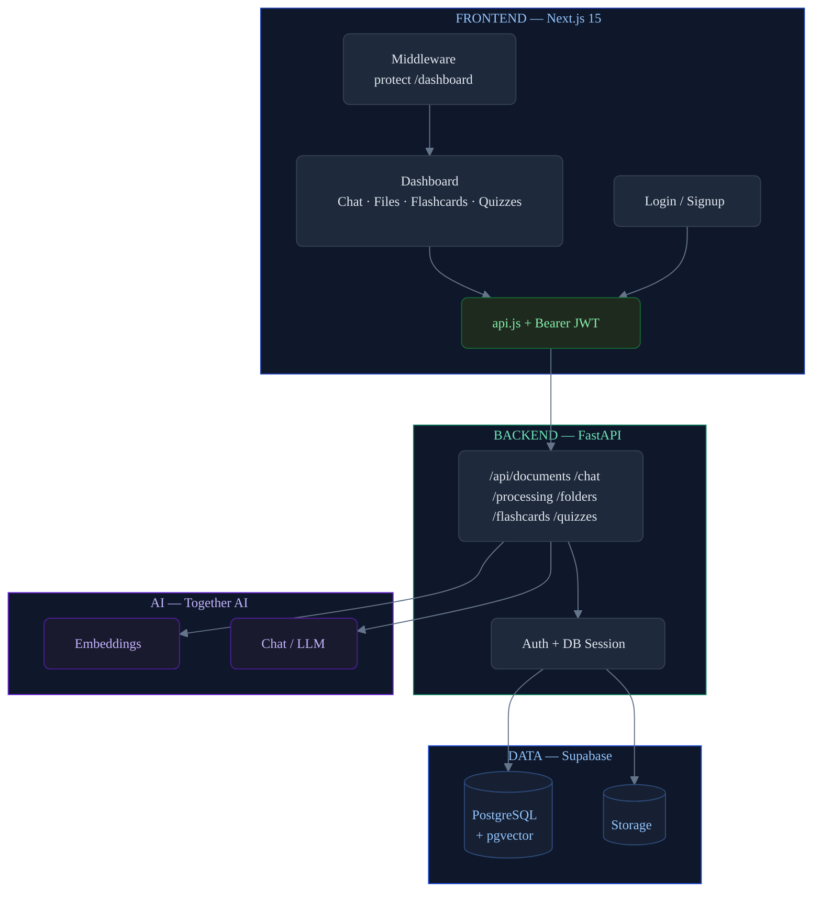

# StudyBudd — System Overview & Architecture

Presentation-ready Mermaid diagrams: **system overview** (what the product is and how users interact with it) and **architecture** (technical components and data flow).

---

## 1. System Overview

High-level view: who uses the app, main features, and external services.

**In one sentence:** Students use StudyBudd (Chat, Files, Flashcards, Quizzes, Sharing, Pomodoro) with auth and data in Supabase and AI from Together.

---

## 2. Architecture

Technical layers: frontend, backend, data, and external APIs.

**Summary:** Next.js calls FastAPI with JWT; FastAPI uses Supabase (PostgreSQL + pgvector + Storage) and Together AI (embeddings + chat). RAG is in `/api/processing`; Chat can call `search_my_documents` for document context.
