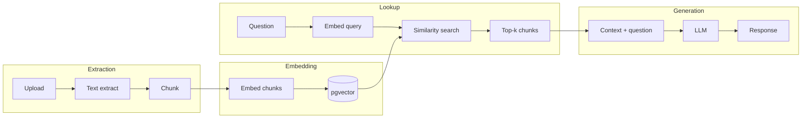
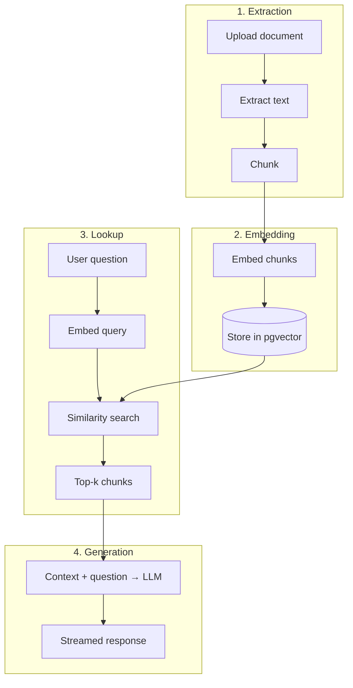
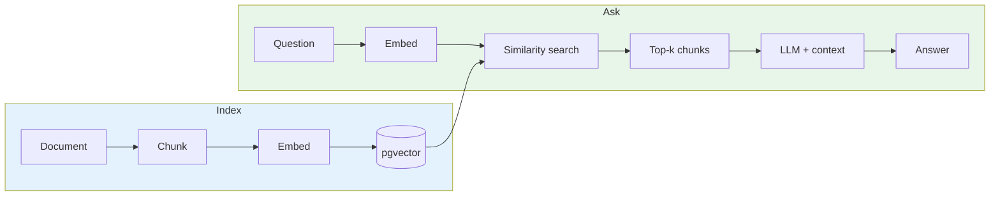
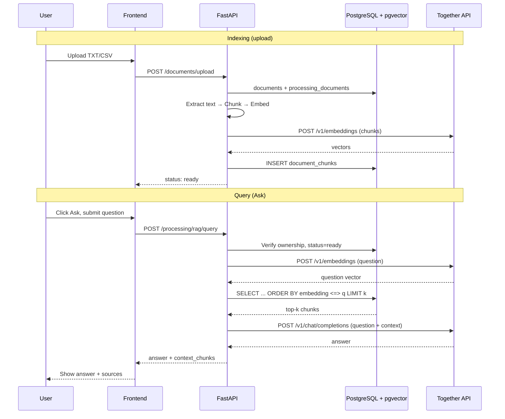
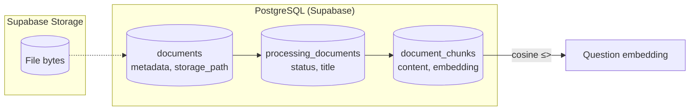

# RAG Pipeline Flow — StudyBudd

Presentation-ready Mermaid diagram of the RAG (Retrieval-Augmented Generation) pipeline.

---

## By phase (recommended for slides)

Grouped into **Extraction → Embedding → Lookup → Generation**. Clear phases, fits a slide.



**Vertical layout (same phases, stacks better in a tall box):**



---

## Full pipeline (Indexing + Query)

```mermaid
flowchart TB
    subgraph Indexing["📥 Indexing (on upload — TXT/CSV)"]
        direction TB
        A[("📄 Document\n(TXT / CSV)")]
        A --> B[Extract text]
        B --> C[Chunk text\n900 chars, 150 overlap]
        C --> D[Embed chunks\nTogether API · BAAI/bge or E5]
        D --> E[("🗄️ document_chunks\npgvector 768/1024-d")]
    end

    subgraph Query["❓ Query (Ask)"]
        direction TB
        Q[("👤 User question")]
        Q --> R[Embed question\nsame model]
        R --> S[Vector similarity search\ncosine distance ≤>]
        E -.-> S
        S --> T[Top-k chunks\ncontext]
        T --> U[Build context string]
        U --> V[LLM: question + context\nTogether API · Llama"]
        V --> W[("📝 Answer")]
    end

    style Indexing fill:#e8f4f8
    style Query fill:#f0f8e8
    style E fill:#d4edda
    style W fill:#d4edda
```

---

## Simplified (high-level)



---

## Sequence (who does what)



---

## Data flow (tables)



---

*Generated from `docs/rag-flow.md` and `apps/api/app/processing/service.py`.*
